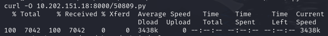
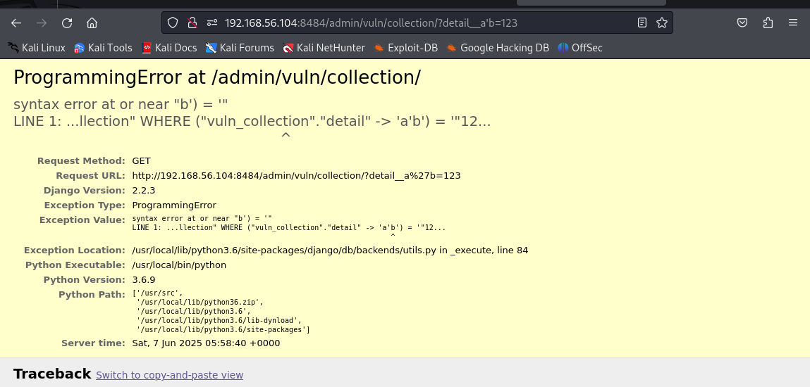

# 内网渗透
## 第三个靶标的征服过程
先安装net-tools，iproute2，nmap，netcat工具

查看目前靶标的网卡，可以看到这个靶标同时与两个子网相连192.218.1.0/24是来时的路，192.215.2.0/24是要去的方向

我们需要找到这个子网中的其它主机，运行nmap -sn 192.215.2.0/24
结果显示这个子网中有四台主机
    192.215.2.1是目前位置
    192.215.2.2是网关
    192.215.2.3和192.215.2.4看起来是其他靶标
之后重启了一次环境，ip有所改变

用脚本扫描功能看一看192.215.2.3
端口8009/tcp开放，服务是ajp13。
端口8080/tcp开放，服务是http-proxy。
_ajp-methods: 未能在OPTION请求中获得有效响应。
http-title: Struts2 Showcase
这个待会再说

用脚本扫描功能看一看192.215.2.4
端口10000/tcp开放，服务是snet-sensor-mgmt

通过-sV参数获取snet-sensor-mgmt服务的具体版本
具体版本是MiniServ 1.984（Webmin httpd）

网上搜到了这个版本的漏洞CVE:2022-0824，以及远程代码执行脚本

把脚本下载下来，然后在目录里搭一个http服务器，让靶机下载这个文件

在攻击者主机那里监听好9000端口

尝试运行脚本，发现python库不全，我得换个思路，让攻击者主机可以访问192.215.2.4:10000，这样就可以远程运行代码了。

在受控靶机上安装dante-server，编辑好danted.conf文件，并启动

在攻击者主机 A (192.168.56.104) 上配置代理
*   `socks5h` 是关键：它使用 SOCKS5 协议，并且对于 `CONNECT` 请求中的主机名解析，会尝试在代理服务器（B）上解析，而不是在客户端（A）上。这对于访问内网 IP 很重要。
*   `192.215.2.4` 是 受控靶机 的 IP 地址。
*   `9050` 是在受控靶机上设置的 SOCKS 代理监听端口。

没反应，打算用内网穿透的办法。
下载frp，编辑frps.toml和frpc.toml

在攻击者主机上运行screen -S frps ./frps -c frps.toml   
打开192.168.56.104:10000登录后可以看到frp服务器页面

在受控靶机上运行 script /dev/null,
然后到frp的目录下运行screen -S frpc ./frpc -c frpc.toml

访问192.168.56.104:8844，成功访问

编写攻击脚本

监听9000端口，运行脚本，拿到反弹shell

拿到flag

## 分支靶标的征服过程
看一下目标靶标都有哪些服务

查看版本，看不出什么名堂

安装frp，启动服务

访问网页

查看漏洞网页，执行了2*3，验证漏洞存在

构造payload，使用base64进行编码

进行url编码，然后加上前后缀

成功获得反向shell

看一下旗子

## 最后一战
先安装net-tools，iproute2，nmap，netcat工具，查看ip，发现有两个网卡。192.216.4.0/24是目标子网

扫描子网中的ip，
192.216.4.1是受控靶机
192.216.4.2是网关
192.216.4.3是目标靶机

8000端口有个http-alt，5432端口有个postgresql

-sV参数看一看版本

一眼看不出漏洞，我先访问一下这个8000端口，看看网页内容吧
看到一个Django

版本是2.2

按照之前的方法搭好frp，成功访问网站

访问192.168.56.104:8484/admin,构造url查询，发现我们输入的语句已经被执行了

构造一个detail__title')='1' or 1=1--并用url编码

显示了所有结果，漏洞存在

创建一个临时表
?detail__title')='1' OR 1=1; CREATE TABLE cmd_exec(cmd_output TEXT);--

我们可以构造一个payload，然后去进行url编码

执行失败了，可能是目标机器上没有netcat

构造一个查看python版本的payload

目标机器上有python

莫名其妙的报错，我同样的payload在攻击者主机上都可以运行了

转回头看看不用nc，只用bash

成功了，诀窍是在代码外面套上bash -c''防止过早解析

胜利的小旗
